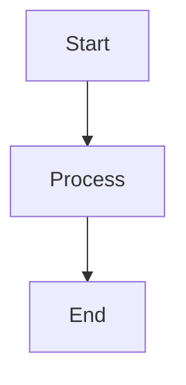

# Google Docs Exporter for Obsidian

> **Work in Progress** - This plugin is under active development. Features may change and bugs may exist.

Export your Obsidian notes to Google Docs-compatible formats with intelligent Mermaid diagram handling, code block preservation, and full markdown formatting support.

## Features

### Intelligent Mermaid Diagram Conversion
- Automatically converts Mermaid diagrams to interactive Mermaid Live editor links
- Preserves diagram editability through clickable links
- Supports all Mermaid diagram types (flowcharts, sequence diagrams, class diagrams, etc.)
- Customizable link text and formatting

### Code Block Preservation
- Maintains code formatting with monospace fonts
- Preserves all whitespace, indentation, and line breaks
- Adds language labels for syntax identification
- Customizable font and background colors
- Supports 100+ programming languages

### Complete Markdown Support
- Headings (H1-H6) → Google Docs heading styles
- **Bold**, *italic*, ~~strikethrough~~ formatting
- Ordered and unordered lists with nesting
- Tables with headers and data rows
- Blockquotes with proper indentation
- Horizontal rules
- Hyperlinks
- Images (embed, link, or skip)
- Inline code formatting

### Obsidian-Specific Features
- YAML frontmatter stripping
- Obsidian callouts (`> [!info]`, `> [!tip]`, `> [!warning]`) converted to styled blockquotes
- Internal links (`[[link]]`) converted to plain text
- Trailing hashtags removed

### Multiple Export Formats
- **DOCX**: Download as Microsoft Word document (opens in Google Docs)
- **Clipboard**: Copy rich text directly to paste into Google Docs
- **HTML**: Export as HTML file for browser viewing

### Customizable Settings
- Default export format
- Mermaid link text and styling
- Code block font and background color
- Language label display
- Image handling options
- Obsidian internal link conversion
- Auto-open after export

## Installation

### Manual Installation
1. Download the latest release from [GitHub Releases](https://github.com/karthyick/obsidian_GoogleDocExporter/releases)
2. Extract `main.js` and `manifest.json` to your vault's plugins folder: `<vault>/.obsidian/plugins/obsidian-gdocs-exporter/`
3. Reload Obsidian
4. Enable the plugin in Settings → Community Plugins

### Build from Source
```bash
git clone https://github.com/karthyick/obsidian_GoogleDocExporter.git
cd obsidian_GoogleDocExporter
npm install
npm run build
```

## Usage

### Quick Export

#### Command Palette
1. Open Command Palette (`Cmd/Ctrl + P`)
2. Choose one of:
   - **Export current note to DOCX** - Quick DOCX export
   - **Export current note to clipboard** - Copy to clipboard
   - **Export to Google Docs...** - Open format selection modal

#### Ribbon Icon
- Click the **file-up** icon in the left sidebar
- Select your preferred export format
- Click **Export**

#### Context Menu
- Right-click any markdown file in the file explorer
- Select **Export to Google Docs**
- Choose format and export

### Working with Mermaid Diagrams

When you export a note containing Mermaid diagrams, they are converted to clickable links:

**Before Export:**
```markdown

```

**After Export:**
View Diagram (Flowchart)

The link opens the diagram in Mermaid Live editor where you can:
- View the rendered diagram
- Edit the diagram code
- Export as PNG/SVG
- Share with others

## Settings

Access settings via: **Settings → Plugin Options → Google Docs Exporter**

### Export Settings
- **Default Export Format**: DOCX, Clipboard, or HTML
- **Open After Export**: Automatically open exported files

### Mermaid Settings
- **Link Text**: Customize the text for Mermaid diagram links (default: "View Diagram")
- **Include Diagram Type**: Show diagram type in link text

### Code Block Settings
- **Font**: Consolas, Courier New, Monaco, Source Code Pro
- **Background Color**: Hex color code (default: #f5f5f5)
- **Include Language Label**: Show language name above code blocks

### Content Settings
- **Image Handling**: Embed, Link, or Skip
- **Remove Obsidian Links**: Convert [[internal links]] to plain text

## Compatibility

- **Obsidian**: Version 0.15.0 or higher
- **Browsers**: Chrome, Edge, Firefox, Safari
- **Google Docs**: All versions
- **Operating Systems**: Windows, macOS, Linux

## Privacy & Security

- **No data collection**: This plugin does not collect or transmit any user data
- **Local processing**: All conversions happen locally on your device
- **No external APIs**: Mermaid Live links are generated locally (no API calls)
- **Open source**: Full source code available for review

## Support

- [Report Issues](https://github.com/karthyick/obsidian_GoogleDocExporter/issues)

## License

MIT License - see [LICENSE](LICENSE) for details

## Author

**KR** - [GitHub](https://github.com/karthyick)

---

Made with care for the Obsidian community
